```text
Знаком ❗️ помечены критически важные замечания, а также места нарушения ТЗ.
```

## Функциональный обзор

- При использовании недопустимого имени, оно не сохраняется в поле ввода и приходится заново его печатать.

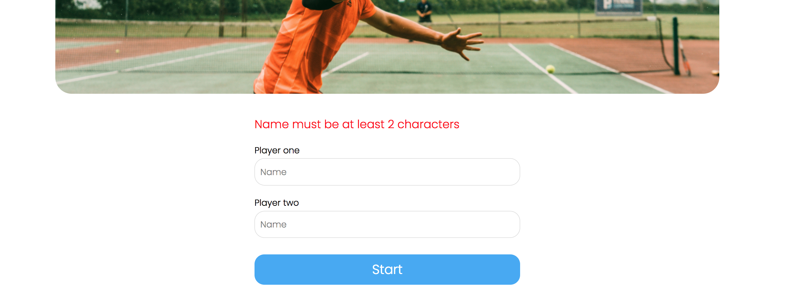

При ошибке лучше оставлять текст в поле ввода — это улучшит пользовательский опыт.

- Если использовать символы из разных алфавитов в одном имени, можно создать игроков с визуально одинаковыми именами

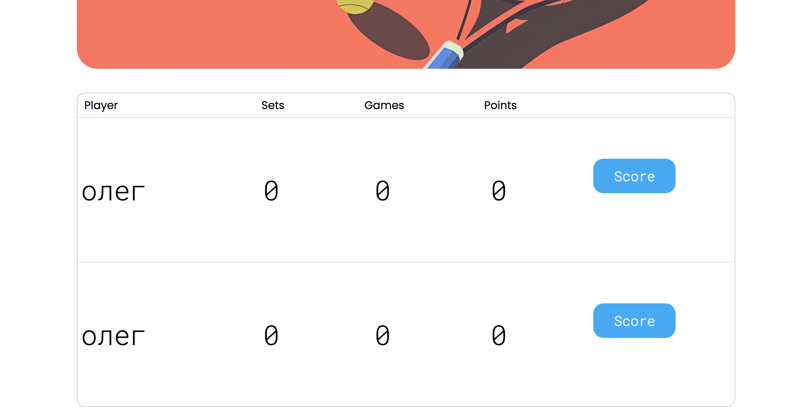

- На странице со списком текущих матчей ссылка на страницу с завершёнными матчами называется "Finished Matches", а на всех остальных страницах просто "Matches".

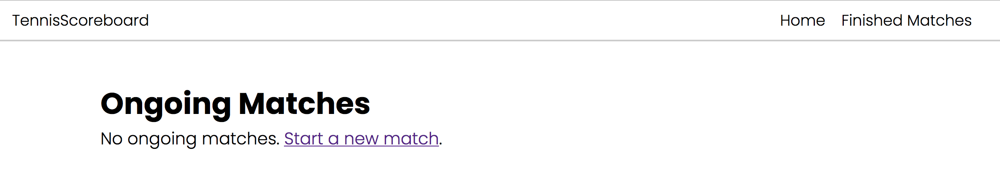

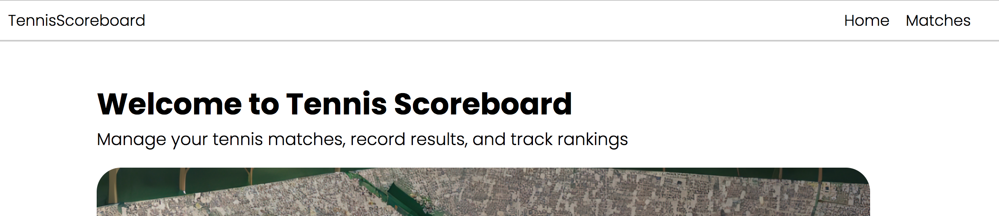

Так как в проекте есть два разных списка матчей, то можно везде называть завёршённые матчи "Finished Matches".

- Текст плейсхолдера в форме фильтра по имени можно назвать просто "name", как в формах при создании нового матча.

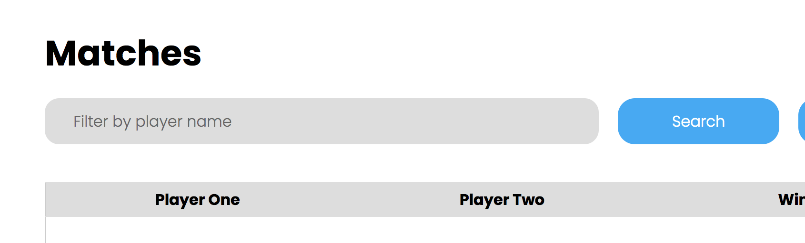

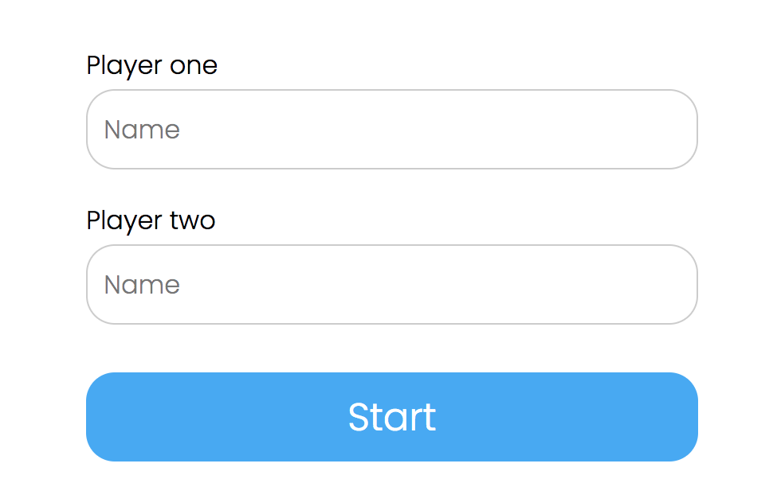

- Сейчас можно создать игроков с такими именами:

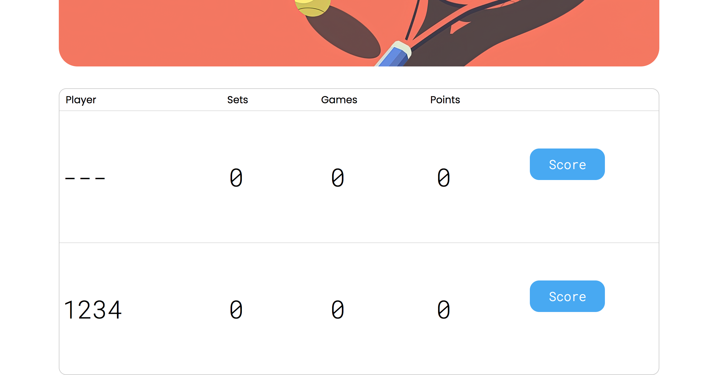

Раз в проекте есть валидация, стоит добавить проверку, что в имени есть буквы и ввести другие уместные ограничения.

- ❗️Сейчас тай-брейк выигрывается при счёте 6-0

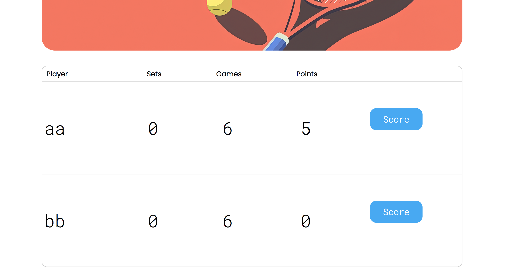

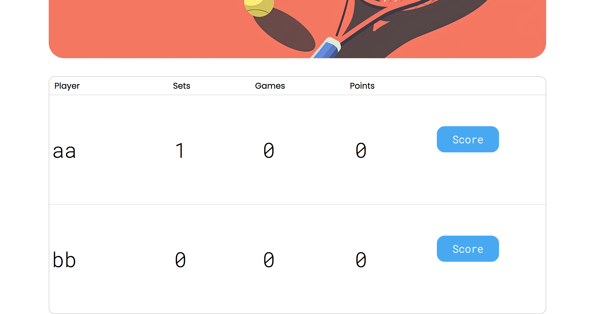

Счёт в тай-брейке должен идти до 7 очков с минимальной разницей в 2 очка.

- ❗️В пагинации на странице завершённых матчей отображаются все страницы, что плохо выглядит при большом количестве страниц и делает недоступными страницы за пределами экрана.

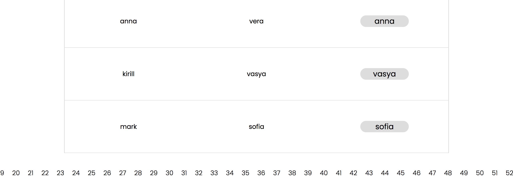

Лучше сделать отображение текущей и +-2 страниц вокруг неё.

- На странице с текущими матчами не отображается счёт в сетах. Например, такой матч:


Выглядит как будто только что начавшийся — с нулевым счётом

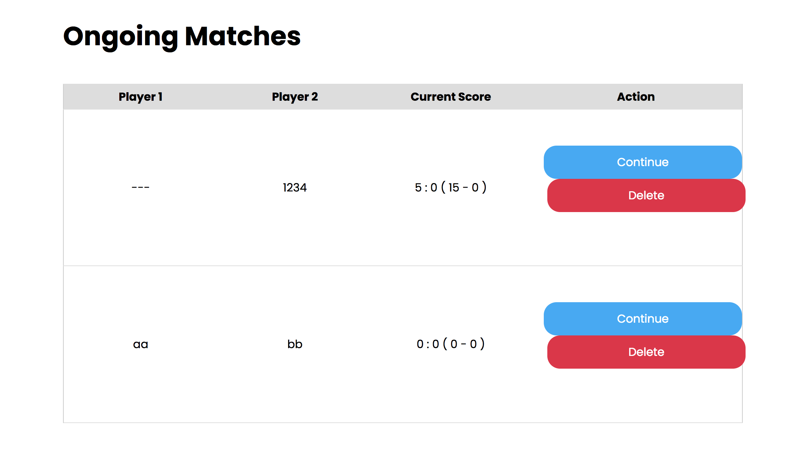

- На странице с текущими матчами кнопка "Delete" немного смещена вправо и выходит за разметку.

- Если другой пользователь удалит текущий матч, то пользователь, который с ним работает при попытке добавить очередное очко увидит неинформативную страницу от томката с ошибкой.

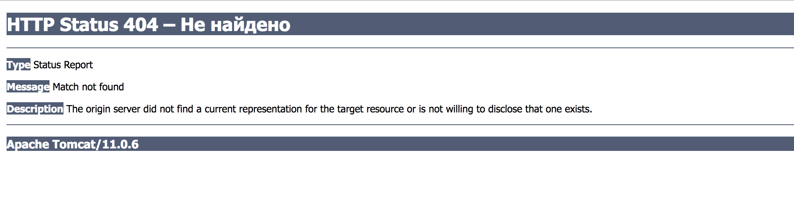

Лучше не давать возможность удалять текущие матчи.

- Поскольку в проекте нет функционала по аутентификации, лучше также не давать возможность доиграть текущий матч, переходом со страницы с их списком.

